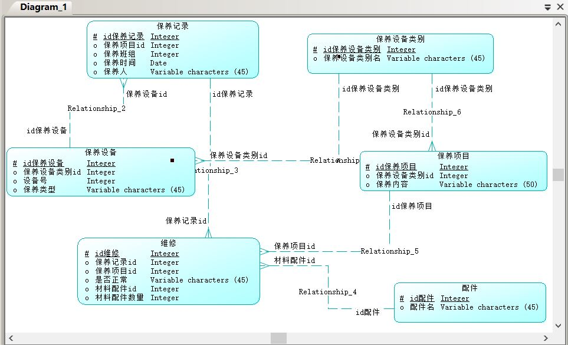
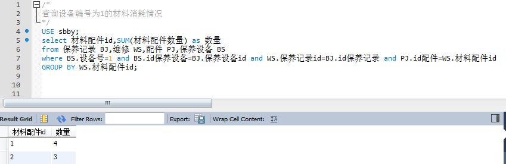
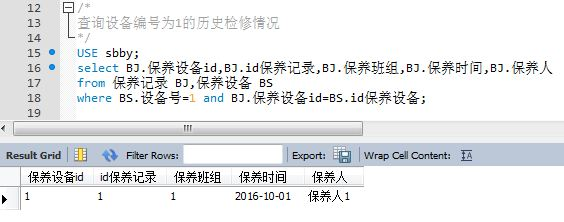
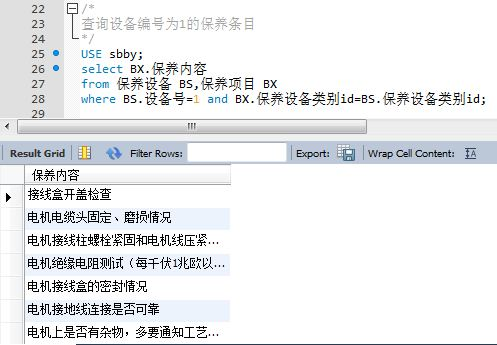

# sbby.github.io
设备保养

***

ER图：

* 查询设备编号为1的材料消耗情况：

`USE sbby;
select 材料配件id,SUM(材料配件数量) as 数量 
from 保养记录 BJ,维修 WS,配件 PJ,保养设备 BS
where BS.设备号=1 and BS.id保养设备=BJ.保养设备id and WS.保养记录id=BJ.id保养记录 and PJ.id配件=WS.材料配件id
GROUP BY WS.材料配件id;`

* 查询设备编号为1的历史检修情况：
`USE sbby;
select BJ.保养设备id,BJ.id保养记录,BJ.保养班组,BJ.保养时间,BJ.保养人
from 保养记录 BJ,保养设备 BS
where BS.设备号=1 and BJ.保养设备id=BS.id保养设备;`

* 查询设备编号为1的保养条目：
`USE sbby;
select BX.保养内容
from 保养设备 BS,保养项目 BX
where BS.设备号=1 and BX.保养设备类别id=BS.保养设备类别id;`

